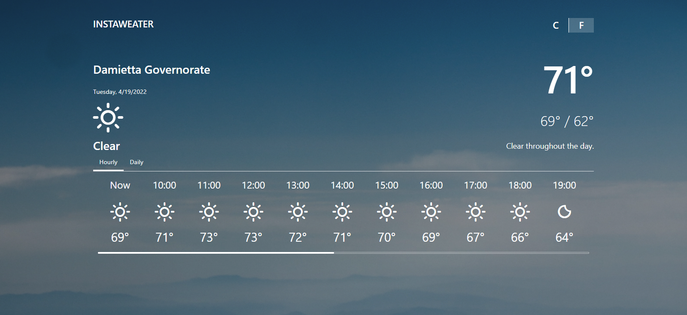

# Instaweather application

## Description
A weather application that displays the current temperature with 24 hours cast, and daily temperature with seven days cast based on the user's location. The temperature can be displayed in both Fahrenheit and Celsius scales.

## Installation
- Clone or download the repo to your computer 
  * If you chose to download, extract the ZIP file that will be downloaded to your computer.
- After cloning or downloading, open the project folder in your preferred text editor. In your text editor open the integrated terminal and run the following command `npm run install` to install the project's dependencies.
- After installing the dependencies, use this link "https://cors-anywhere.herokuapp.com/corsdemo" to request temporary access to the CORS-anywhere demo server in order to successfully make an API call to the Dark Sky API, which this application is utilizing to get the weather data.
- After requesting temporary access to the CORS-anywhere server, go back to your text editor and in the integrated terminal run `npm run start` to start the development version of the app.

## Technologies
This application is built using JavaScript, React.js, and CSS3/Bootstrap for styling. 
